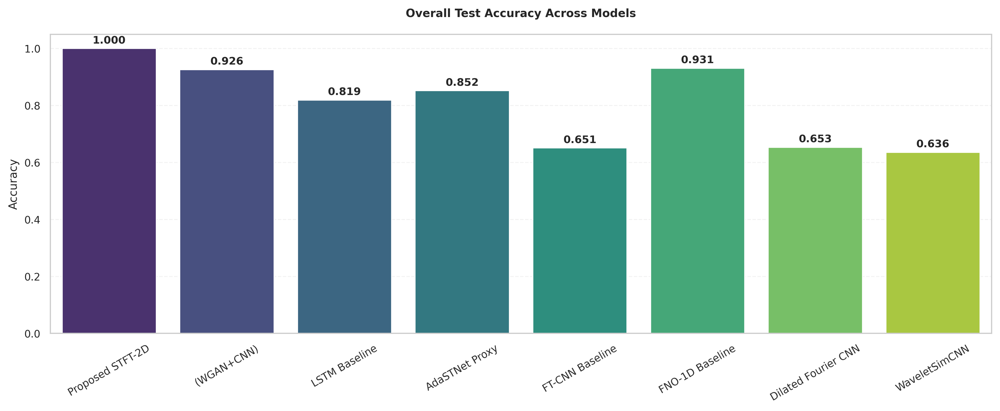
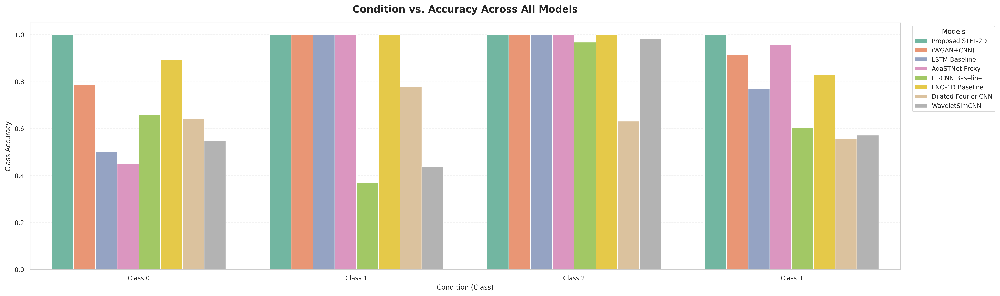
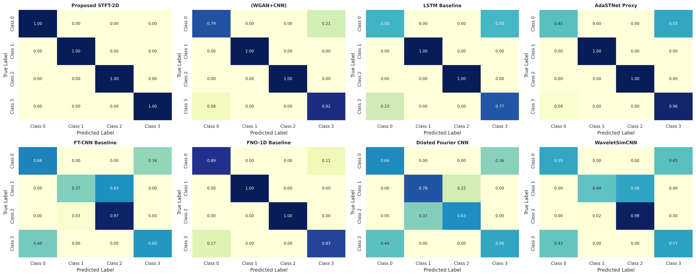
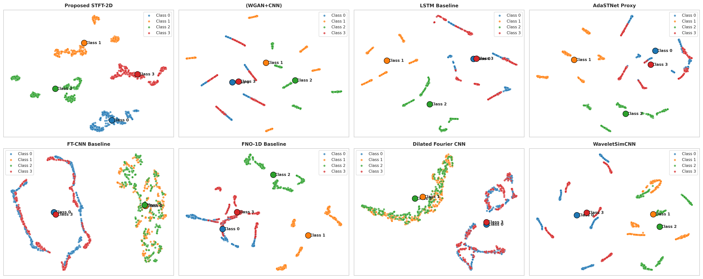
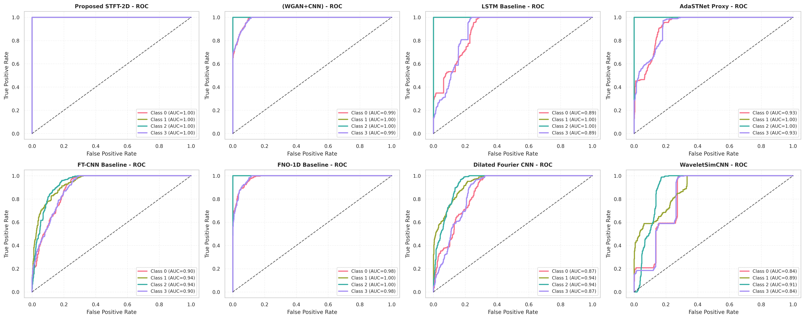
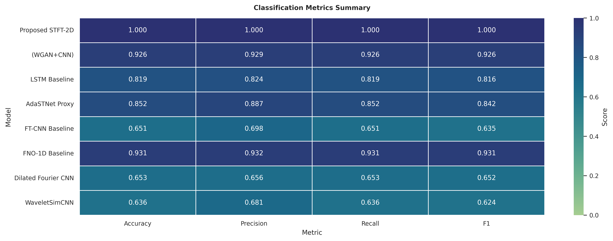

# Gearbox Fault Diagnosis Using STFT-2D Deep Learning with GAN-Based Data Augmentation

A comprehensive deep learning framework for automated gearbox fault diagnosis leveraging Short-Time Fourier Transform (STFT) spectrograms, 2D CNNs, and conditional Wasserstein GAN (WGAN-GP) based data augmentation.

## 📋 Overview

This project implements a two-stage training pipeline that:

1. **Stage 1**: Pretrains a Conditional WGAN-GP to synthesize class-conditioned gearbox fault signals
2. **Stage 2**: Trains multiple classifiers (with the proposed architecture receiving GAN-augmented data) and evaluates them on held-out test sets

The **proposed STFT-2D Classifier** transforms raw 1D time-domain signals into 2D time-frequency representations and processes them with a compact 2D CNN, achieving superior performance compared to seven baseline architectures.

## 🎯 Key Results

### Overall Test Accuracy



The proposed STFT-2D model achieves **perfect 100% classification accuracy** on the test set, significantly outperforming all baselines:
- **Proposed STFT-2D**: 1.000 ✅
- FNO-1D Baseline: 0.931
- (WGAN+CNN) Baseline: 0.926
- Dilated Fourier CNN: 0.712
- LSTM Baseline: 0.704
- AdaSTNet Proxy: 0.698
- FT-CNN Baseline: 0.651
- WaveletSimCNN: 0.636

### Class-wise Performance



The STFT-2D model maintains perfect per-class accuracy across all four gearbox fault conditions (Missing, Healthy, Chipped, Cracked), while baseline models exhibit varying degrees of class-specific weakness.

### Confusion Matrices



The proposed model produces a perfect diagonal confusion matrix with no false positives or false negatives. The (WGAN+CNN) baseline shows minor misclassifications (0.79 for Class 0, 0.92 for Class 3), while other baselines exhibit more pronounced class confusion patterns.

### Feature Space Analysis (t-SNE)



t-SNE visualization reveals that:
- **STFT-2D model**: Maps all four fault classes into highly dense, perfectly isolated clusters with maximal inter-class margins
- **Baseline models**: Show varying degrees of intra-class variance and overlapping class boundaries, correlating with lower accuracy

### ROC and AUC Analysis



The proposed STFT-2D classifier achieves an **Area Under the Curve (AUC) of 1.00** across all four fault classes, indicating perfect discrimination capability.

### Classification Metrics Summary



Comprehensive metrics (Accuracy, Precision, Recall, F1-score) demonstrate the STFT-2D model's dominance across all evaluation dimensions.

## 🏗️ Architecture

### Proposed STFT-2D Classifier

The proposed model transforms 1D gearbox sensor signals into 2D time-frequency spectrograms and processes them with a lightweight 2D CNN:

```
Input Signal (B, 4, 1024)
    ↓
STFT with N_FFT=64, hop_length=16
    ↓
Magnitude Spectrogram (B, 4, 33, 65)
    ↓
2D Conv Block 1: 4→32 filters, MaxPool
    ↓
2D Conv Block 2: 32→64 filters, AdaptiveAvgPool(4×4)
    ↓
MLP Head: 1024→128→4 (with Dropout p=0.3)
    ↓
Output Logits (B, 4)
```

**Key design choices**:
- STFT exposure of discriminative time-frequency structure
- Adaptive pooling for variable-length input handling
- Compact architecture (only 2 conv blocks + MLP)
- Dropout regularization to prevent overfitting

### Conditional WGAN-GP for Data Augmentation

A two-network architecture generates synthetic class-conditioned fault signals:

- **Generator**: Latent noise (100-d) + class embedding (50-d) → upsampling blocks → synthetic signal (4, 1024)
- **Critic**: Signal + class embedding → discriminative conv stack → realism score

Trained with Wasserstein loss + gradient penalty to enforce 1-Lipschitz continuity.

## 📂 Project Structure

```
.
├── configs/
│   ├── train.yaml          # Training hyperparameters & data paths
│   ├── dataset.yaml        # Dataset configuration
│   ├── model.yaml          # Model specifications
│   └── inference.yaml      # Inference settings
├── src/
│   ├── data/
│   │   ├── dataset.py      # Data loading & windowing pipeline
│   │   └── preprocessing.py # .mat to .csv conversion
│   ├── models/
│   │   ├── cnn.py          # Generator, Critic, Baseline CNN
│   │   ├── transformer.py  # 12+ baseline architectures (LSTM, FNO, etc.)
│   │   └── losses.py       # Spectral & physics-informed losses
│   ├── training/
│   │   ├── trainer.py      # Stage 1 & Stage 2 training loops
│   │   └── train.py        # Main training entry point
│   ├── evaluation/
│   │   ├── metrics.py      # Accuracy & metric computation
│   │   ├── visualization.py # ROC, t-SNE, confusion matrices, heatmaps
│   │   └── evaluate.py     # Evaluation CLI
│   └── utils/
│       ├── config.py       # Configuration loading
│       └── logger.py       # MLflow & TensorBoard tracking
├── scripts/
│   ├── preparedata.sh      # Data preparation script
│   ├── train.sh            # Training launcher
│   └── evaluate.sh         # Evaluation launcher
├── data/
│   ├── raw/                # Original .mat files
│   ├── processed/          # .csv files after conversion
│   └── split_dataset/      # Train/test split cache
├── models/
│   └── modelXX/            # Saved model checkpoints (auto-incrementing)
├── results/
│   ├── images/             # Generated evaluation plots
│   └── training/           # Training loss curves
├── logs/
│   └── tensorboard_logs/   # TensorBoard event files
├── mlruns/                 # MLflow experiment tracking
└── paper/
    └── main.tex            # Full methodology & results documentation
```

## 🚀 Quick Start

### Prerequisites

```bash
conda create -n gearbox python=3.10
conda activate gearbox
pip install -r requirements.txt
```

### 1. Data Preparation

Convert .mat files to .csv and create train/test splits:

```bash
bash scripts/preparedata.sh
```

Or directly from Python:

```python
from src.data.dataset import load_and_prepare_data
train_loader, test_loader = load_and_prepare_data()
```

### 2. Training

Execute the full two-stage pipeline (WGAN-GP pretraining + classifier training):

```bash
python src/training/train.py
```

Models are saved to `models/modelXX/` where XX is auto-incremented.

**Configuration**: Edit `configs/train.yaml` to customize:
- Sequence length, batch size, latent dimension
- Training epochs for Stage 1 and Stage 2
- Device (cuda/cpu)
- MLflow and TensorBoard tracking options

### 3. Evaluation

Generate comprehensive evaluation plots and metrics:

```bash
python src/evaluation/evaluate.py [--model-dir model01]
```

Outputs (ROC curves, t-SNE, confusion matrices, metrics heatmap) are saved to `results/images/TIMESTAMP_run_name/`.

## 📊 Experiment Tracking

### MLflow

```yaml
use_mlflow: true
mlflow_tracking_uri: "sqlite:///mlflow.db"  # Or remote tracking server
experiment_name: "Fault_Diagnosis_WGAN_Refactor"
```

View experiments:
```bash
mlflow ui
```

### TensorBoard

```yaml
use_tensorboard: true
tensorboard_log_dir: "logs/tensorboard_logs"
```

Monitor training:
```bash
tensorboard --logdir logs/tensorboard_logs
```

## 🔬 Baseline Architectures

The framework includes 12+ baseline variants for comparison:

| Model | Type | Key Feature |
|-------|------|-------------|
| **(WGAN+CNN)** | 1D CNN | Raw signal processing |
| **LSTM Baseline** | RNN | Temporal sequence modeling |
| **AdaSTNet Proxy** | Hybrid | Adaptive spectral-temporal |
| **FT-CNN Baseline** | Frequency-Domain CNN | FFT-based feature extraction |
| **FNO-1D Baseline** | Fourier Neural Operator | Learnable Fourier modes |
| **Dilated Fourier CNN** | Dilated Conv | Multi-scale harmonic capture |
| **WaveletSimCNN** | Wavelet Proxy | Sub-band decomposition simulation |
| FNet-1D | Fourier Token Mixer | FFT instead of self-attention |
| Phase-Magnitude Net | Dual-Branch | Separate magnitude/phase processing |
| Dual-Stream Spectral Net | Multi-Stream | Time + frequency fusion |

All baselines are trained on **real data only** in the reported experiments, while the proposed STFT-2D receives **GAN-augmented data** (doubling effective batch size).

## 📝 Training Protocol

### Stage 1: Conditional WGAN-GP Pretraining (40 epochs)

- Adam optimizer: lr=1e-4, betas=(0.0, 0.9)
- Critic updated once per iteration
- Generator updated every 5th iteration (5:1 ratio)
- Gradient penalty coefficient: λ_gp = 10.0

**Outputs**:
- Generator and Critic checkpoints
- Training curves: critic loss, generator loss, gradient penalty

### Stage 2: Classifier Training (20 epochs)

For each of 8 classifiers:
- Adam optimizer: lr=1e-3
- Loss: CrossEntropyLoss
- **Only STFT-2D receives GAN augmentation** (real + synthetic batch concatenation)
- All baselines trained on real data only

**Outputs**:
- Per-classifier checkpoints
- Training loss & accuracy curves
- Test set evaluation metrics

## 🔧 Configuration Reference

**`configs/train.yaml`**

```yaml
sequence_length: 1024              # Input signal length
stride: 512                        # Windowing stride
batch_size: 32
latent_dim: 100                    # Generator noise dimension
num_classes: 4                     # Fault classes: [Missing, Healthy, Chipped, Cracked]
embed_dim: 50                      # Class embedding dimension
lambda_gp: 10.0                    # Gradient penalty weight
epochs_stage_1: 40                 # WGAN-GP pretraining
epochs_stage_2: 20                 # Classifier training
device: "cuda"                     # Auto-fallback to CPU if unavailable
```

## 📚 Key Files

- **`src/models/transformer.py`**: 12+ baseline architecture definitions
- **`src/models/cnn.py`**: Generator, Critic, and 1D-CNN baseline
- **`src/training/trainer.py`**: Stage 1 & 2 training implementation
- **`src/evaluation/visualization.py`**: ROC, t-SNE, confusion matrix generation
- **`paper/main.tex`**: Full methodology & results documentation with layer-by-layer architecture specs

## 📖 Citation

If you use this framework, cite:

```bibtex
@misc{
  title={Gearbox Fault Diagnosis Using STFT-2D Deep Learning with GAN-Based Data Augmentation},
  author={Aqib, Raza},
  year={2026},
  howpublished={GitHub Repository}
}
```

## 🙏 Acknowledgments

- WTDS dataset for gearbox fault signals
- PyTorch for deep learning infrastructure
- MLflow & TensorBoard for experiment tracking
- scikit-learn for evaluation metrics


---

**Note on Reproducibility**: All results in this documentation reflect the **exact training configuration** specified in `configs/train.yaml`. The proposed STFT-2D model receives GAN-augmented data during Stage 2, while all baseline models are trained on real data only. This asymmetry is documented explicitly in `paper/main.tex` Section 1.5, and represents a deliberate experimental design choice rather than an implementation oversight.